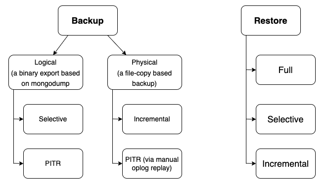

# Backup and restore types

You can use several types of database backups and restores to develop your backup strategy. 

The following table provides an overview of each type

| Type           | Status  | Version added | Supported deployments | Percona Server for MongoDB | MongoDB Community /Enterprise Edition | 
| ---------------| -------- | ------------ | ----------------------| ------------------ | ---------------------------------------|
| [Logical](logical.md)| GA      | 1.0.0         | Sharded clusters and non-sharded replica sets | Yes | Yes | 
| [Physical](physical.md) | GA      | 2.0.0         | Sharded clusters and non-sharded replica sets | Yes (starting with 4.2.15-16, 4.4.6-8 and higher, 5.0.x, 6.0.x) | No | 
| [Selective](selective-backup.md) | [Tech preview](../reference/glossary.md#technical-preview-feature)| 2.0.0         | Sharded clusters (starting with version 2.0.3) and non-sharded replica sets. Sharded collections are supported starting with version 2.1.0. | Yes | Yes | 
| [Incremental](incremental-backup.md) | GA | 2.1.0 (Supported for PSMDB versions 4.2.24-24, 4.4.18-18, 5.0.2-1, 6.0.2-1 and higher) | Sharded clusters and non-sharded replica sets | Yes  | No |  
| [Point-in-time recovery](point-in-time-recovery.md) | GA | 1.3.0 (logical), 2.0.0 (physical manually), 2.2.0 (physical automated)  | Sharded clusters and non-sharded replica sets | Yes | Yes |
| [Snapshot-based](snapshots.md) | [Tech preview](../reference/glossary.md#technical-preview-feature) | 2.2.0 | Sharded clusters and non-sharded replica sets | Yes | No | 

