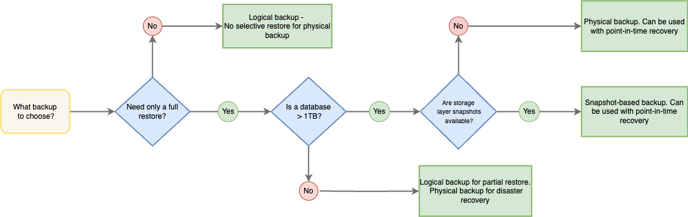

# Backup and restore types

You can use several types of database backups and restores to develop your backup strategy. 

Not sure what exactly backup you need? The following diagram helps you decide:

The following table provides an overview of each type:

| Type           | Version added |  When to use | Supported deployments | Percona Server for MongoDB | MongoDB Community /Enterprise Edition |
| ---------------| ------------ | ----------------------| ------------------ | ---------------------------------------| ----------| 
| [Logical](logical.md)  <small>GA</small>|  1.0.0 | - Selective restore of a specific database or a collection in a cluster (starting with version 2.0.0)   - Resilient to major / minor version changes in MongoDB and can be used for migration   - Both MongoDB and PBM run in Docker| Sharded clusters and non-sharded replica sets | Yes | Yes | 
| [Physical](physical.md)  <small>GA</small> |  2.0.0  | - Full restore of a very large (e.g. Terabytes of data) dataset to a specific point in time with guaranteed data consistency   - Faster restores compared to logical ones | Sharded clusters and non-sharded replica sets | Yes (starting with 4.2.15-16, 4.4.6-8 and higher, 5.0.x, 6.0.x and higher) | No | 
| [Selective](selective-backup.md)  <small>GA</small> | 2.5.0  | Restore of the desired subset of data without disrupting the operations of your whole cluster| Sharded clusters starting with version 2.0.3. Sharded collections starting with version 2.1.0. | Yes | Yes | 
| [Incremental](incremental-backup.md)  <small>GA</small> | 2.1.0 (For PSMDB versions 4.2.24-24, 4.4.18-18, 5.0.2-1, 6.0.2-1 and higher) | Save on disk space for large backups where the data needs to be frequently backed up | Sharded clusters and non-sharded replica sets | Yes  | No |  
| [Point-in-time recovery](point-in-time-recovery.md)  <small>GA</small> | 1.3.0 (logical)   2.0.0 (physical manually)   2.2.0 (physical automated)  | Full restore of a database to a specific point in time with guaranteed data consistency | Sharded clusters and non-sharded replica sets | Yes | Yes |
| [Snapshot-based](snapshots.md)  <small>GA</small> | 2.6.0 | Restore of a very  large data set (e.g. Terabytes of data) with almost immediate access to data. A drawback is no guarantee for data consistency in your cluster | Sharded clusters and non-sharded replica sets | Yes | No | 

