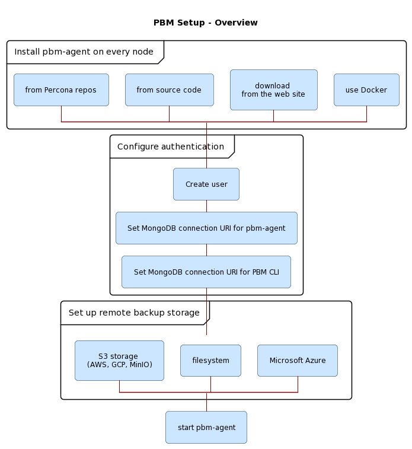

# Initial setup overview

The following diagram outlines the installation and setup steps:

After you [installed Percona Backup for MongoDB](../installation.md) on every server with the `mongod` node that is not an arbiter node, complete the following setup steps:

1. [Configure authentication in MongoDB](configure-authentication.md).

2. [Configure the remote backup storage](backup-storage.md).

3. [Start `pbm-agent` process](start-pbm-agent.md).

## Next steps

[Configure authentication :material-arrow-right:](configure-authentication.md){.md-button}