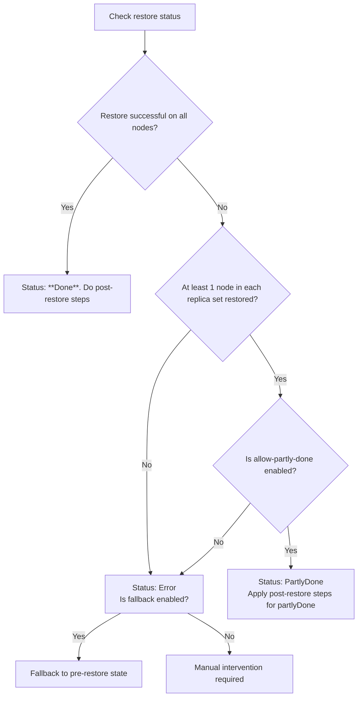

# Handling partial physical restores

When you restore a physical backup, the operation can result in the following statuses:

- **Done**: The restore completed successfully on all nodes.
- **Error**: The restore failed and could not be completed.
- **Partly-Done**: The restore was successful on at least one node in each replica set, but failed on some nodes. This status is only possible if the `allowPartlyDone` option is enabled (default).

PBM gives you configuration options to control how partial restores are handled:

- `allowPartlyDone` (default: `true`): When enabled, PBM lets the restore finish with the `partlyDone` status if at least one node in each replica set is restored successfully. The failed nodes will receive data via initial sync.
- `fallbackEnabled` (default: `false`): When enabled, PBM creates a fallback copy of the data directory at the restore start. If the restore fails, PBM reverts your cluster to its pre-restore state ensuring that it remains operational. Read more about [restores with fallback directory](../features/physical.md/#physical-restores-with-a-fallback-directory)

## Restore status decision flow

The decision flow is explained below:

1. **Check the restore status** with `pbm describe-restore <restore_name>` or `pbm status`.
2. **Did the restore succeed on all nodes?**
    - **Yes**: The status is **Done**. Continue with [post-restore steps](#post-restore-steps).
    - **No**: Go to the next step.
3. **Did at least one node in each replica set restore successfully?**
    - **Yes**: Is `allowPartlyDone` enabled?
        - **Yes**: The status is **PartlyDone**. See [Handling partlyDone restores](#handling-partlydone-restores).
        - **No**: If `fallbackEnabled` is enabled, PBM triggers a fallback procedure and restores your cluster to its pre-restore state. If `fallbackEnabled` is disabled, the restore status is **Error**.
    - **No**: The status is **Error**. If `fallbackEnabled` is enabled, PBM triggers a fallback procedure. If not, you'll need to intervene manually.

## Handling `partlyDone` restores

If your restore finishes with the **partlyDone** status, you can still start the cluster and wait for the failed node to receive the data via the initial sync. Here's what you need to do:

1. Check the restore status with `pbm status` or `pbm describe-restore <restore_name>`.
2. Start all `mongod` nodes. The failed nodes will perform initial sync from the healthy nodes.
3. Wait for the nodes to complete initial sync and report the `ready` status.
4. Start `pbm-agents` on every node.
5. Start the balancer and all `mongos` nodes.
6. Make a fresh backup to serve as the new base for future restores.
7. [Enable point-in-time recovery](../features/point-in-time-recovery.md/#enable-point-in-time-recovery) if you need it.